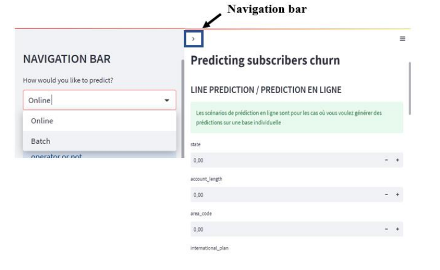
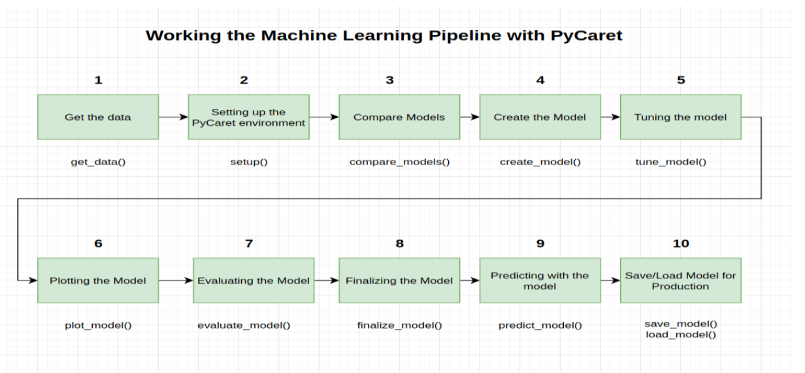

# 🔮 Telecom Churn Prediction Project

<p align="center">

</p>

## 📝 Description

Ce projet vise à mettre en place et déployer un modèle de **Machine Learning** capable de prédire le "Churn" (l'attrition) dans le secteur des télécommunications. L'objectif est d'identifier les clients susceptibles de résilier leur abonnement afin de permettre à l'opérateur de prendre des mesures proactives de fidélisation.

Réalisé dans le cadre du cours "Application de l'IA aux réseaux télécoms" (2022/2023), ce projet utilise **PyCaret** pour l'automatisation du ML et propose trois méthodes de déploiement : **Streamlit**, **FastAPI** et **Flask**.

## ⚙️ Pipeline Machine Learning & Architecture

Le projet suit un pipeline rigoureux, allant de la préparation des données au déploiement du modèle final.

<p align="center">

</p>

### Étapes clés :

1. **Données :** Dataset Kaggle (3333 clients, 21 attributs).
2. **Préparation :** Nettoyage et équilibrage des classes (fix imbalance) via **SMOTE** car la classe "Churn" est minoritaire.
3. **Modélisation avec PyCaret :** Comparaison de plusieurs modèles (Random Forest, Decision Tree, etc.).
4. **Meilleur Modèle :** Le modèle **XGBoost** a été retenu avec une précision d'environ **94.9%**.
5. **Sauvegarde :** Le modèle final est exporté sous `ChurnModel.pkl`.

## 🚀 Fonctionnalités de l'Application

L'application déployée (via Streamlit) offre plusieurs fonctionnalités interactives :

* **Prédiction en Ligne (Online) :** Saisie manuelle des caractéristiques d'un client unique pour obtenir une prédiction immédiate.
* **Prédiction par Lot (Batch) :** Chargement d'un fichier CSV contenant plusieurs clients pour générer des prédictions en masse.
* **Visualisation des Données :** Génération de graphiques (Histogrammes, Scatter plots, Box plots) pour explorer le dataset.
* **Audit des Données :** Affichage des statistiques descriptives et des dimensions du dataset importé.

## 🛠 Stack Technique & Prérequis

Le projet nécessite un environnement virtuel spécifique pour éviter les conflits de versions.

**Langage :** Python 3.8 
**Bibliothèques principales :**

* `PyCaret` (2.3.10) : AutoML
* `Scikit-learn` (0.23.2)
* `Streamlit` (1.18.1) : Interface Web Data
* `FastAPI` : API haute performance
* `Flask` (2.2.3) : Micro-framework web
* `XGBoost` (1.7.4) 

## 💻 Installation et Configuration

Pour reproduire cet environnement, il est recommandé d'utiliser **Anaconda**.

1. **Création de l'environnement virtuel :**
```bash
conda create --name projectenv python=3.8
conda activate projectenv
```

2. **Installation des dépendances :**
```bash
pip install scikit-learn==0.23.2
pip install pycaret==2.3.10
pip install streamlit==1.18.1
pip install fastapi uvicorn
pip install flask==2.2.3
```

## ▶️ Comment lancer l'application ?

Le projet propose trois interfaces de déploiement distinctes. Choisissez celle qui convient à votre besoin.

### Option 1 : Interface Graphique Complète (Streamlit)

C'est l'interface principale recommandée pour la visualisation et les tests utilisateurs.

```bash
streamlit run strlt.py
```

### Option 2 : API Rapide (FastAPI)

Pour accéder à la documentation interactive Swagger UI et tester l'API.

```bash
uvicorn api:app --reload
```

> Rendez-vous ensuite sur : `http://127.0.0.1:8000/docs`


### Option 3 : Application Web (Flask)

Pour une interface web classique.

```bash
python app.py
```

> Rendez-vous ensuite sur : `http://127.0.0.1:5000`


## 👥 Auteurs

Projet réalisé par :

* **Steve SANOGO**
* **Habib AIDARA**
* **René Lothaire BAZIE**

